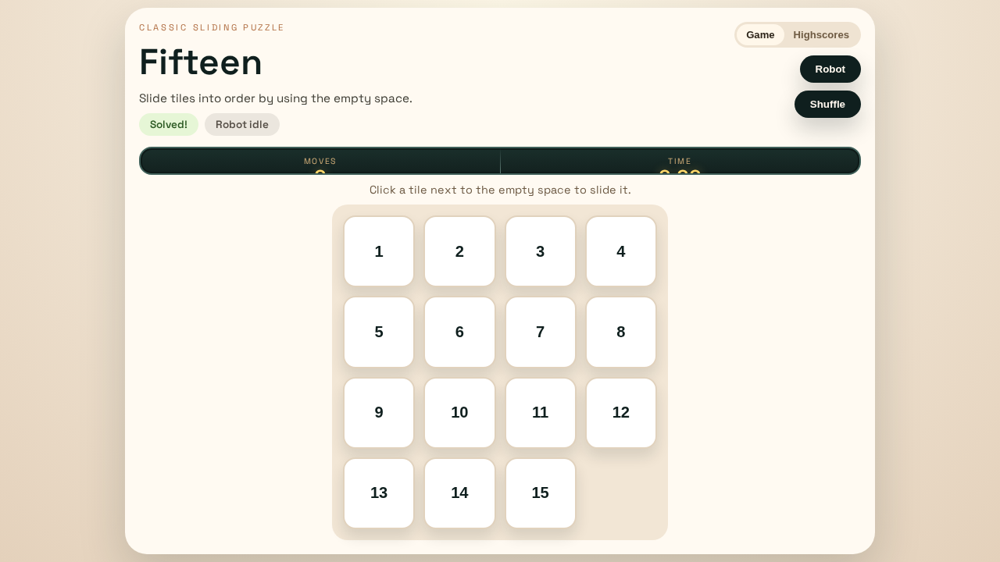

# Fifteen

Fifteen is a browser-based version of the classic 15-puzzle.  
The goal is to slide numbered tiles into ascending order by moving tiles into the single empty space.

## Gameplay Screenshot



## Features

- 4x4 sliding puzzle board
- Move counter and elapsed timer
- Shuffle that keeps the puzzle solvable
- Win detection with celebration fireworks
- Highscore list saved in browser local storage
- Built-in robot solver for auto-solving

## Architecture and Planning Docs

- [Solver plugin runway architecture](docs/solver-plugin-architecture.md)
- [Solver acceptance criteria](docs/solver-acceptance-criteria.md)
- [Benchmark corpus and scoring rubric](docs/benchmark-corpus-rubric.md)
- [Domain migration plan](docs/domain-migration-plan.md)

## Getting Started

```bash
npm install
npm run dev -- --host 0.0.0.0 --port 5173
```

## Build

```bash
npm run build
npm run preview
```

## Tests

```bash
npm test -- --run
npm run test:bdd
```
